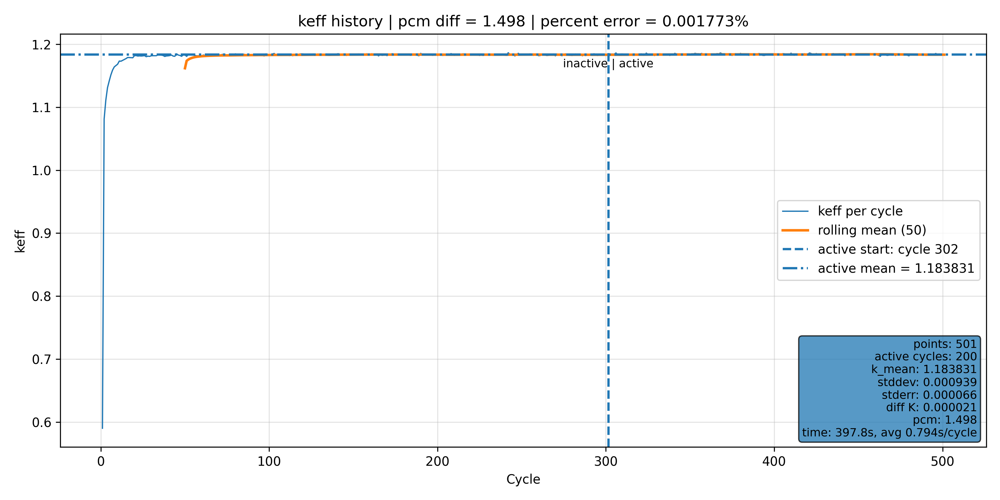

# C5G7 Benchmark - Implicit Capture (Force Fission), Full Core Tally

Reference 3-D Eignevalue: k = 1.183810 

Mine: k = 1.183831 (+1.49 pcm difference)

### k-Eigenvalue Plot:

### Flux Tally @ z = 0 - 1.26 cm

<!--
### Some Stats

-->
